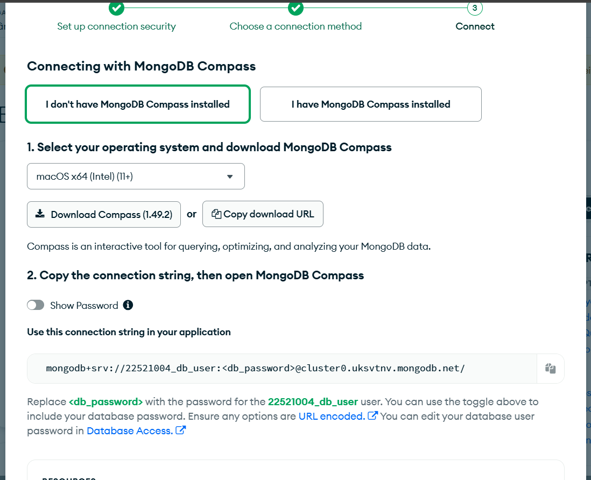
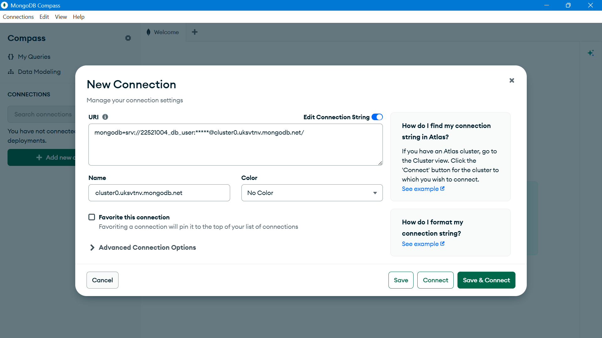
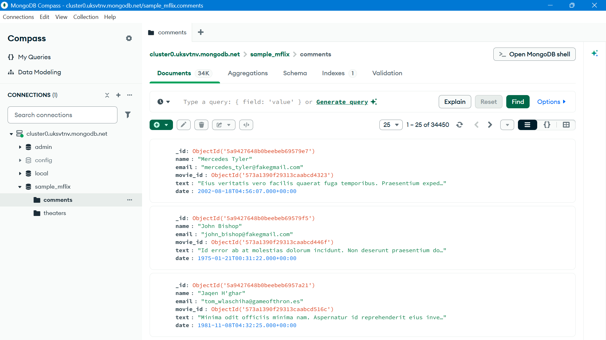

# Lab 01 – MongoDB CRUD Operation

Họ và tên: Nguyễn Trọng Nhân
MSSV: 22521004
Môn học: IE213.Q21

Lab01

Câu 1: Đăng ký MongoDB Atlas & tạo cluster

Câu 2: Tải dữ liệu mẫu

Câu 3: Cài đặt MongoDb Compass

Câu 4: Kết nối MongoDb Compass với cluster

