# Lab 01 – MongoDB CRUD Operation

Họ và tên: Nguyễn Trọng Nhân
MSSV: 22521004
Môn học: IE213.Q21

Lab01
Bài 1:
Câu 1: Đăng ký MongoDB Atlas & tạo cluster
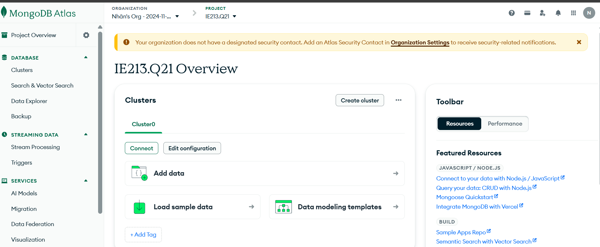
Câu 2: Tải dữ liệu mẫu
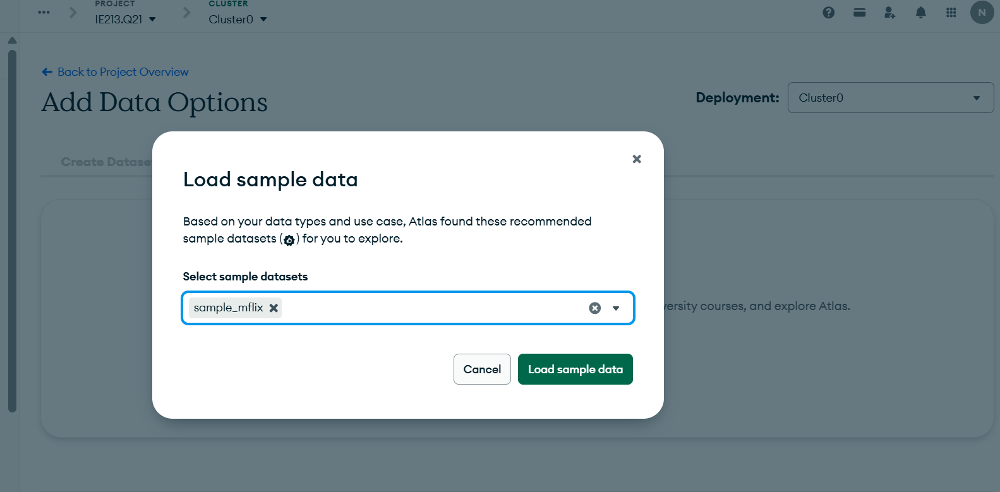
Câu 3: Cài đặt MongoDb Compass

Câu 4: Kết nối MongoDb Compass với cluster

Bài 2:
Câu 1: Tạo CSDL có tên 22521004-IE213
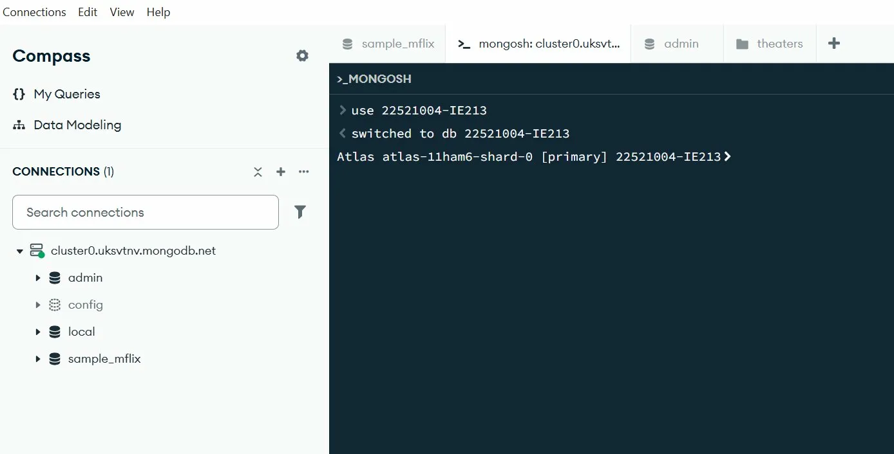
Câu 2: Thêm các document vào collection có tên employeee
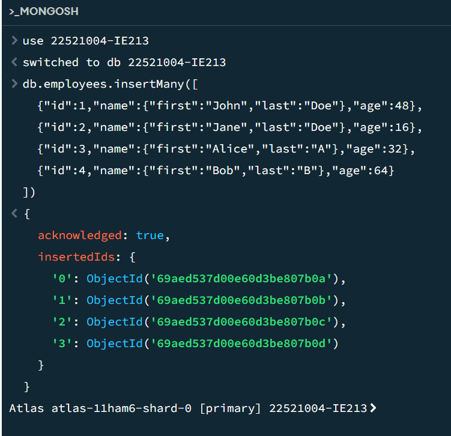
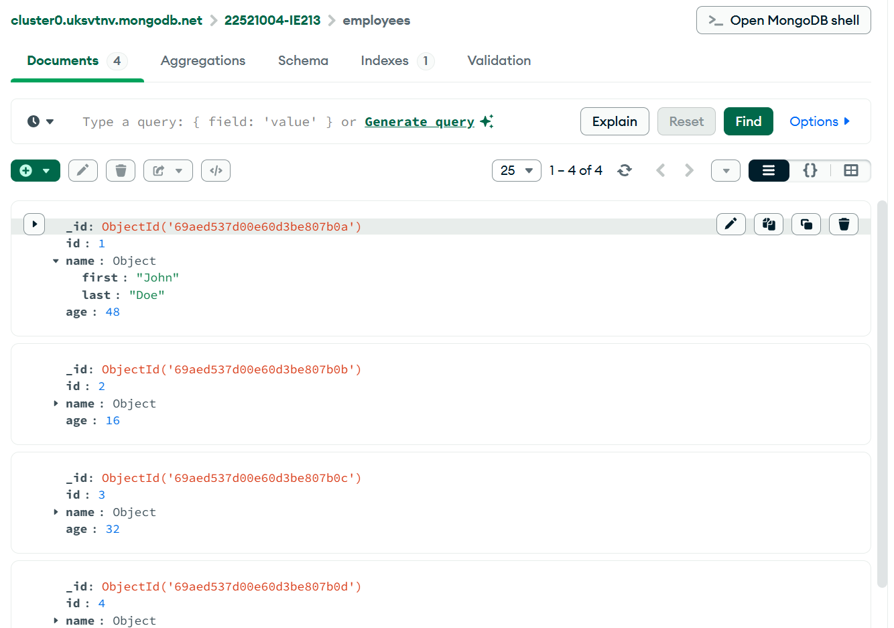

db.employees.insertMany([
{"id":1,"name":{"first":"John","last":"Doe"},"age":48},
{"id":2,"name":{"first":"Jane","last":"Doe"},"age":16},
{"id":3,"name":{"first":"Alice","last":"A"},"age":32},
{"id":4,"name":{"first":"Bob","last":"B"},"age":64}
])

Câu 3: Biến trường id trong các document trở nên duy nhất
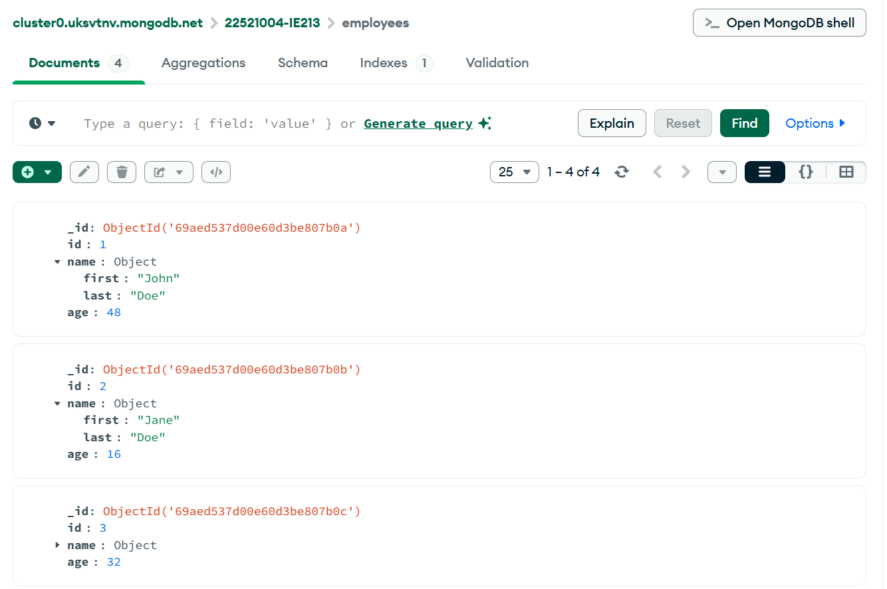
db.employees.createIndex({id: 1}, {unique: true})

Câu 4: Viết lệnh để tìm document có first name la John và last name là Doe
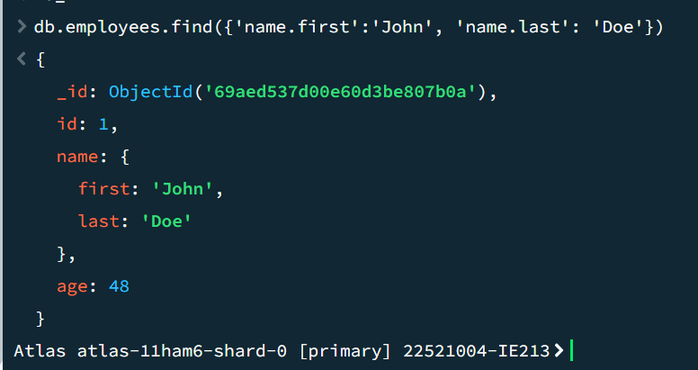
db.employees.find({'name.first':'John', 'name.last': 'Doe'})

Câu 5: Viết lệnh để tìm người có tuổi lớn hơn 30 và nhỏ hơn 60
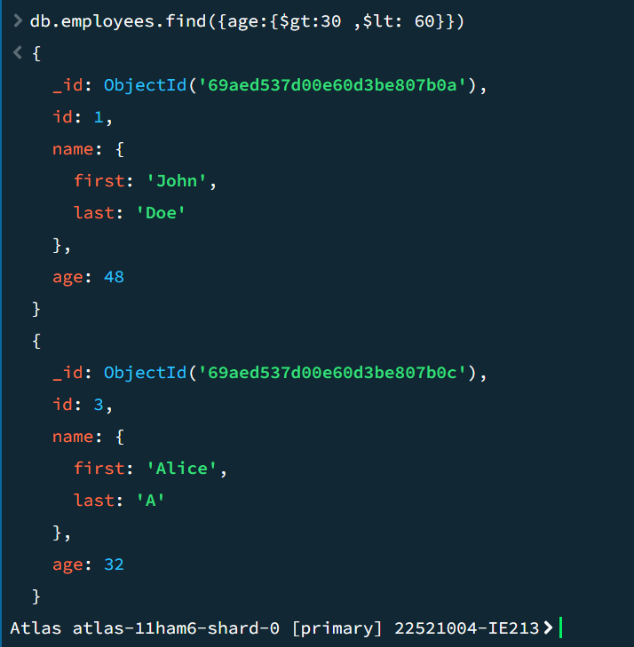
db.employees.find({age:{$gt:30 ,$lt: 60}})

Câu 6: Thêm các document và tìm các document có middle name
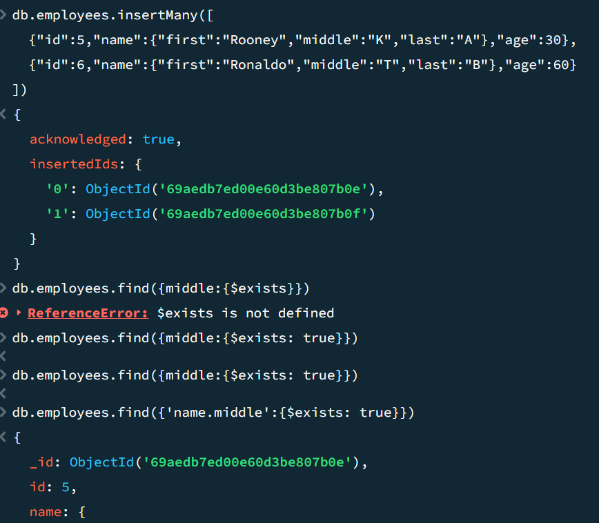
db.employees.insertMany([
{"id":5,"name":{"first":"Rooney","middle":"K","last":"A"},"age":30},
{"id":6,"name":{"first":"Ronaldo","middle":"T","last":"B"},"age":60}
])
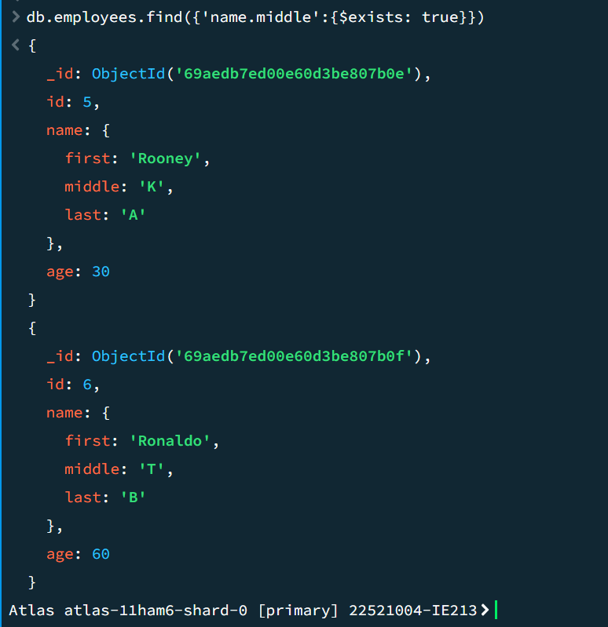
db.employees.find({'name.middle':{$exists: true}})

Câu 7: Xóa middle name
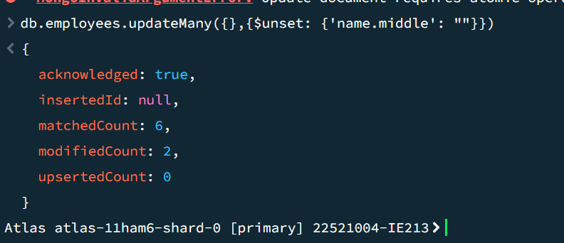
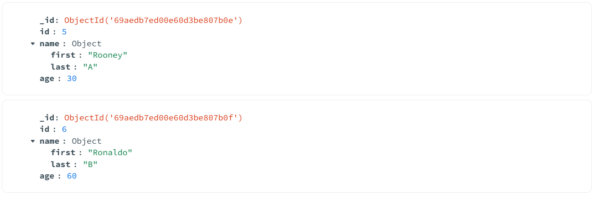
db.employees.updateMany({},{$unset: {'name.middle': ""}})

Câu 8: Thêm trường organization: "UIT" vào tất cả document
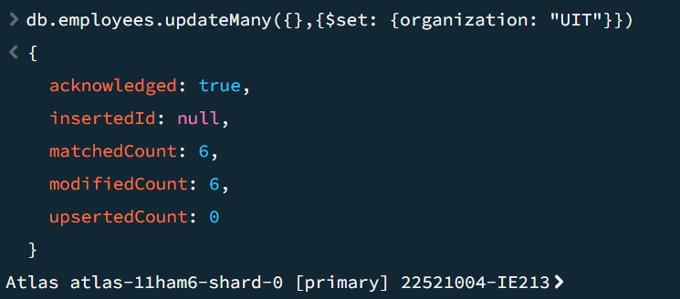
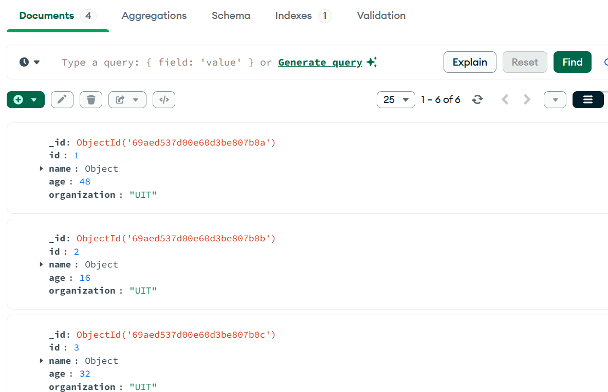
db.employees.updateMany({},{$set: {organization: "UIT"}})

Câu 9: Đổi giá trị organization của 2 nhân viên có id là 5 và 6 thành USSH
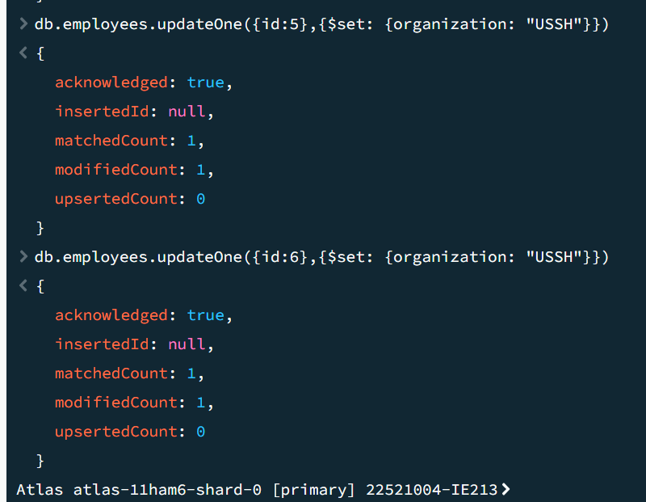
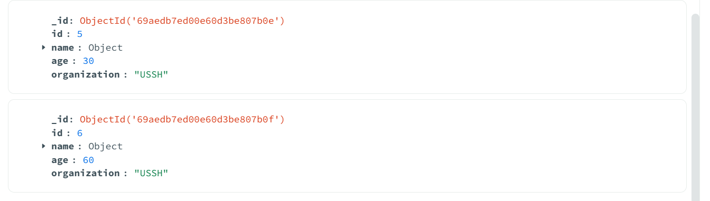
db.employees.updateOne({id:5},{$set: {organization: "USSH"}})
db.employees.updateOne({id:6},{$set: {organization: "USSH"}})

Câu 10: Tính tổng tuổi và tuổi trung bình của nhân viên thuộc 2 organization
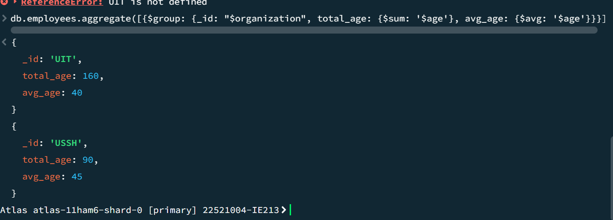
db.employees.aggregate([
{$group: {_id: "$organization", total_age: {$sum: '$age'}, avg_age: {$avg: '$age'}}}
])
