# Lab 02 – THIẾT LẬP BACKEND VỚI NODE|EXPRESSJS

Họ và tên: Nguyễn Trọng Nhân

MSSV: 22521004

Môn học: IE213.Q21

---

## Bài 1:

### 1.1 Tải và cài đặt nodejs. Kiểm tra cài đặt thành công với câu lệnh node -v.

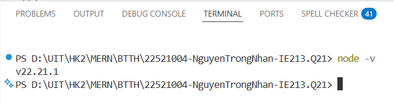

---

### 1.2 Tải và cài đặt Visual Studio Code (hoặc editor tương tự).

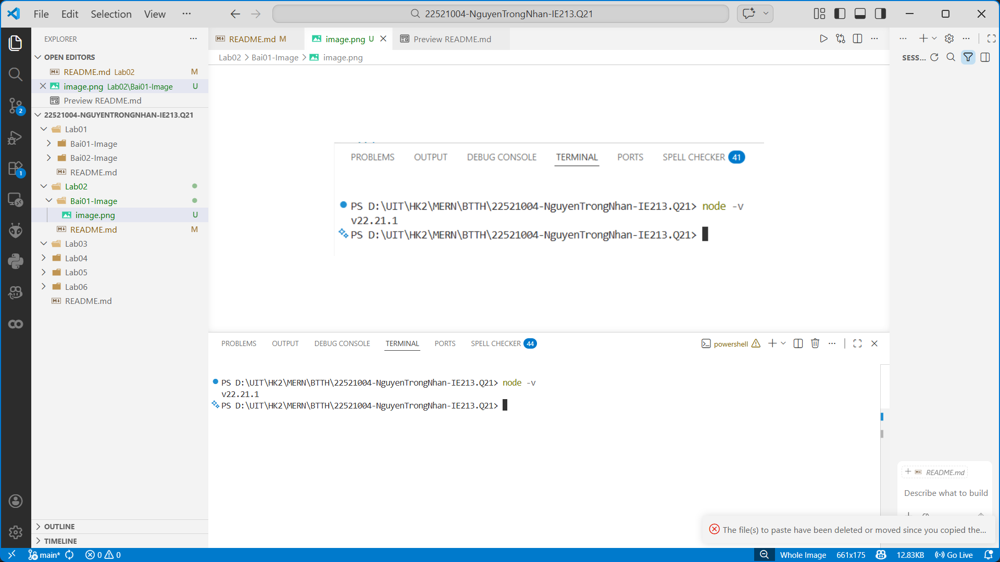

---

### 1.3 Khởi tạo cây thư mục dự án

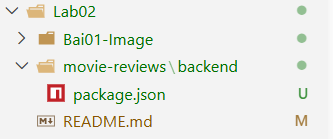

---

### 1.4 Khởi tạo dự án với câu lệnh npm init

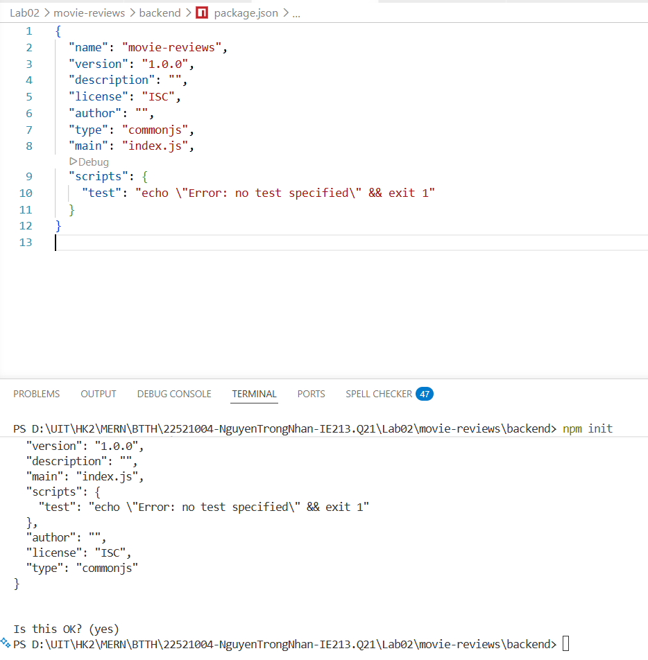

---

### 1.5 Cài đặt các dependency: mongodb, express, cors, dotenv

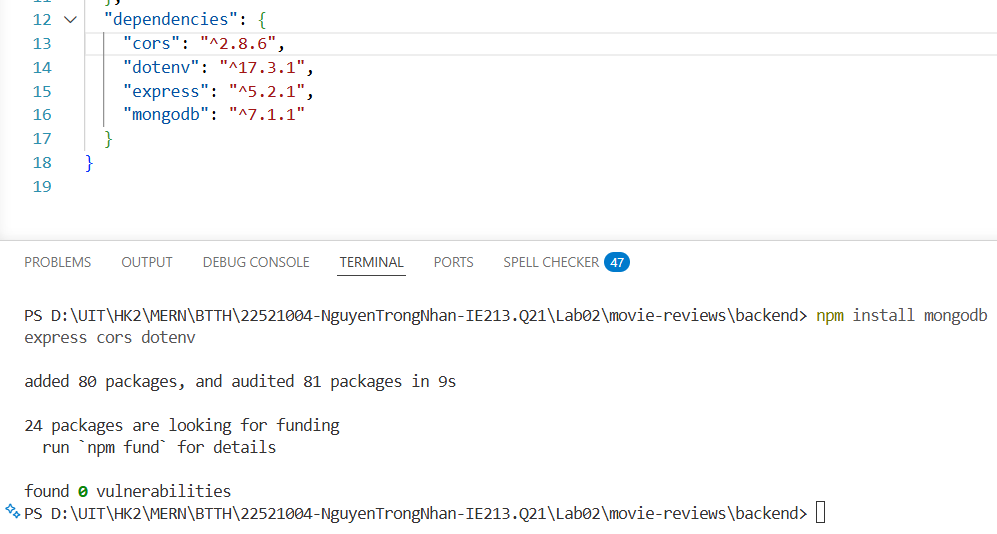

---

### 1.6 Cài đặt nodemon

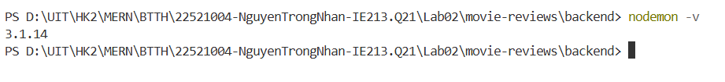

## Bài 2:

### 2.1 Tạo tệp tin server.js – khởi tạo máy chủ web, thêm middleware express/cors, xử lý lỗi 404, định tuyến tới /api/v1/movies.

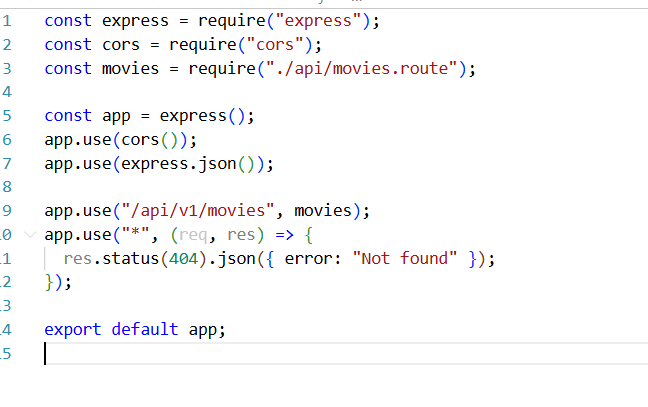

---

### 2.2 Tạo tệp tin .env – lưu URI kết nối MongoDB Atlas và PORT.

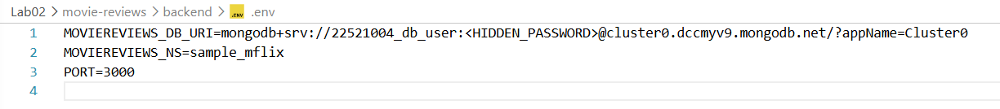

---

### 2.3 Tạo tệp tin index.js – quản lý kết nối dữ liệu và chạy máy chủ.

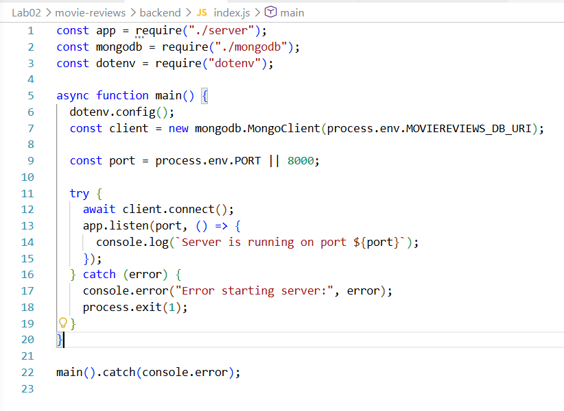

---

### 2.4 Tạo api/movies.route.js – định tuyến / trả về 'hello world'. Truy cập localhost:3000/api/v1/movies sẽ trả về 'hello world'

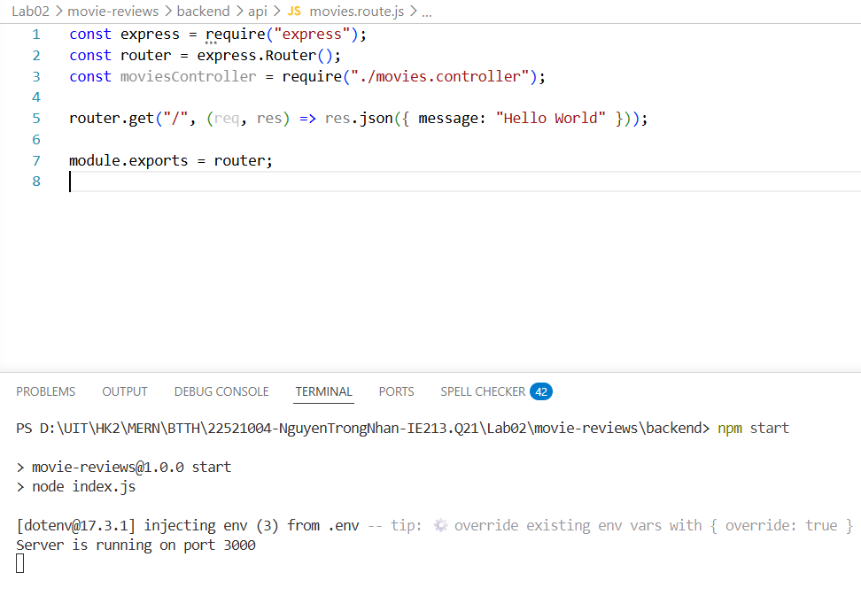
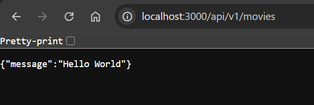

---

### 2.5 Tạo dao/moviesDAO.js – class MoviesDAO với 2 phương thức injectDB() và getMovies() (mặc định: không filter, trang 0, tối đa 20 phim). Khởi tạo đối tượng trong index.js.

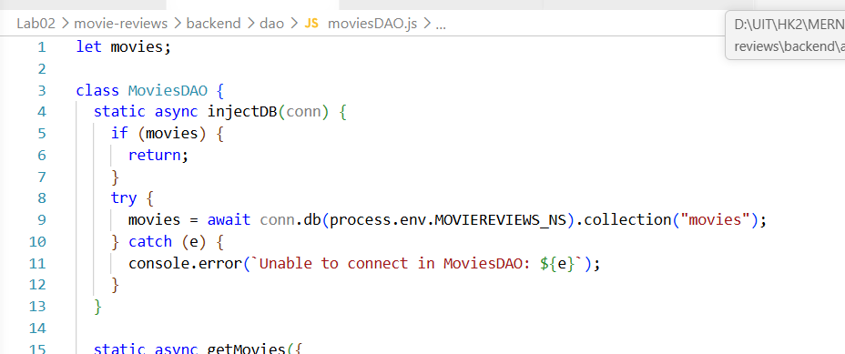

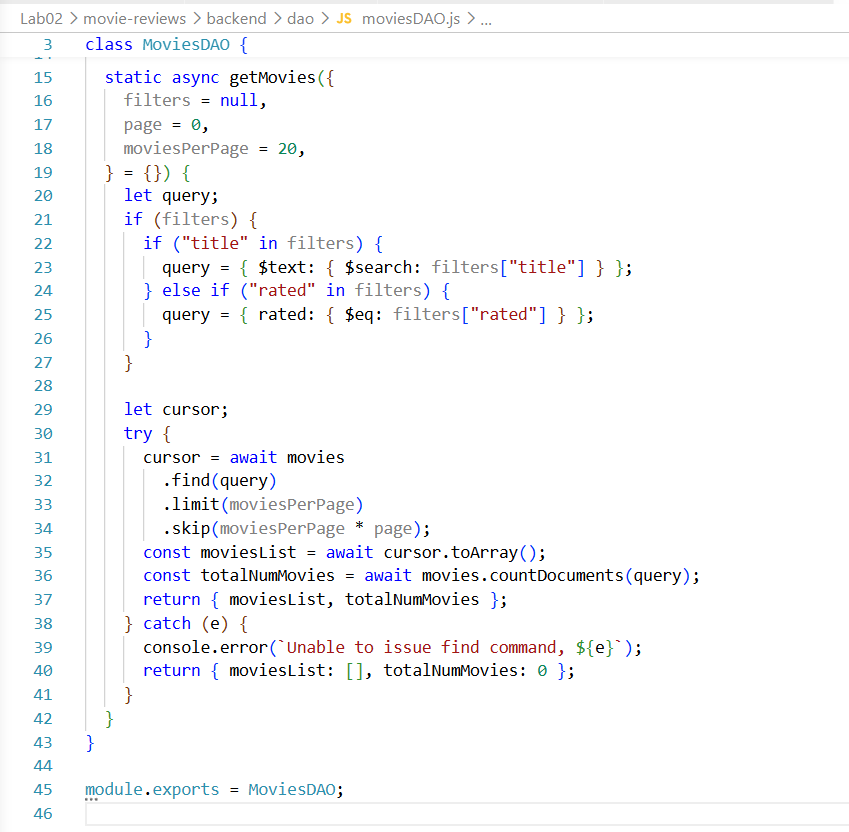

---

### 2.6 Tạo api/movies.controller.js – class MoviesController với function apiGetMovies() gọi tới getMovies() trong DAO và trả về JSON.

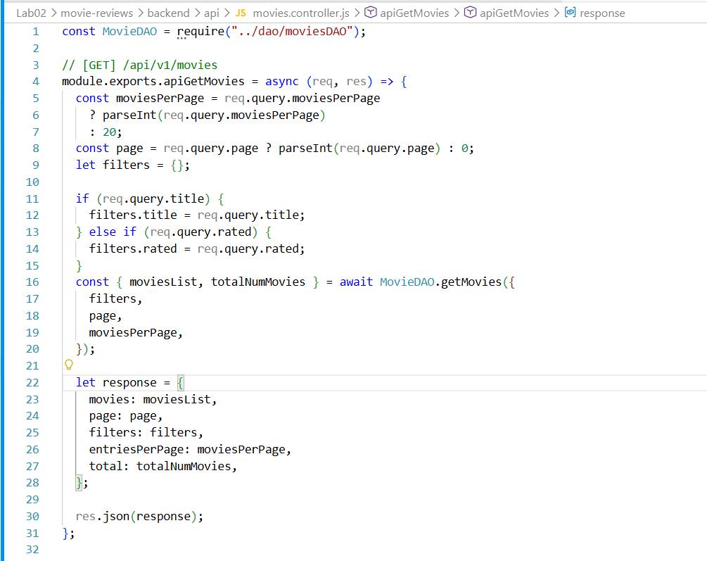

---

### 2.7 Đưa controller vào định tuyến – GET localhost:3000/api/v1/movies/ gọi apiGetMovies() và trả về danh sách phim dạng JSON.

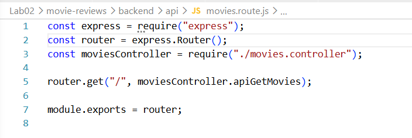
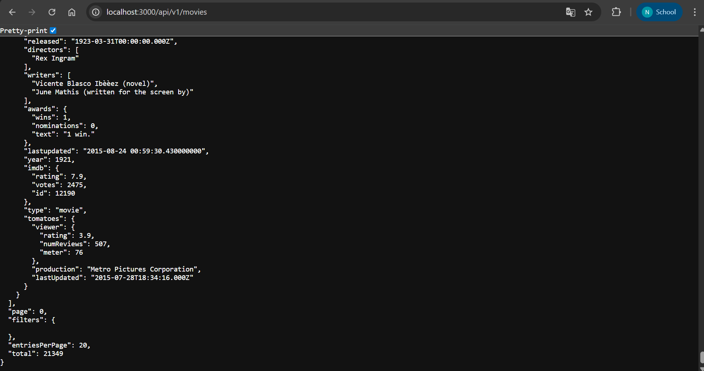
