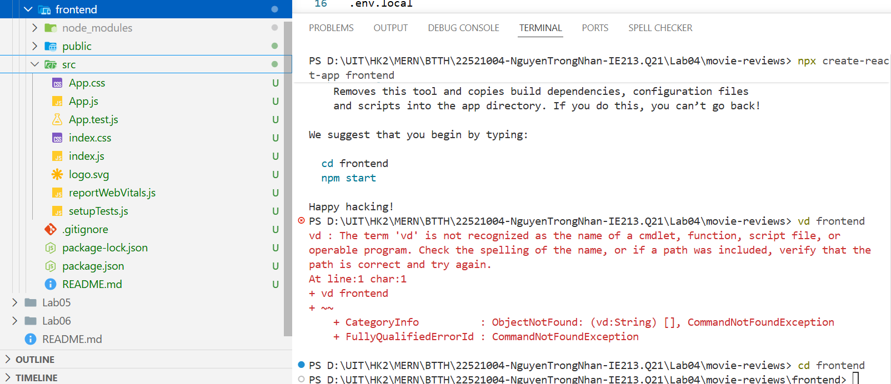
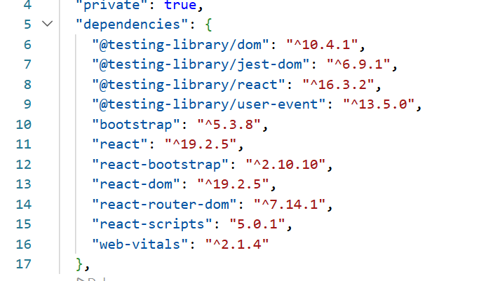
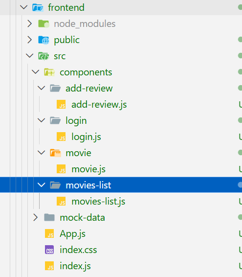
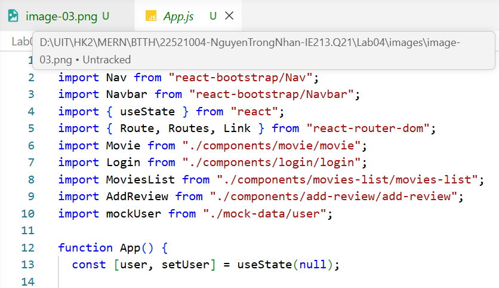
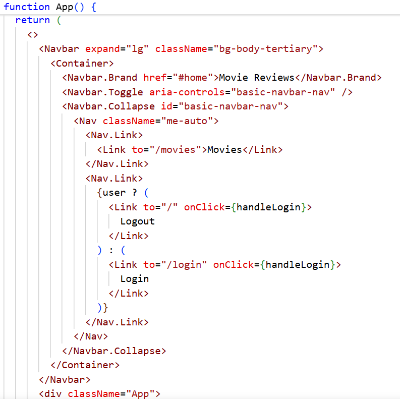
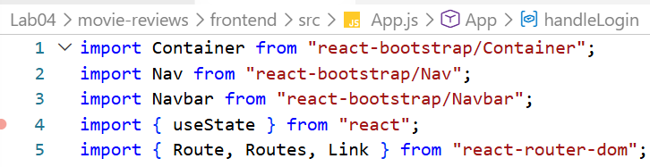
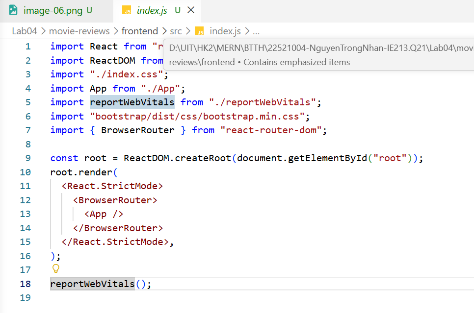
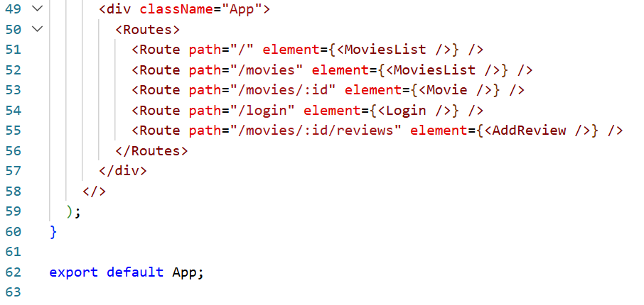
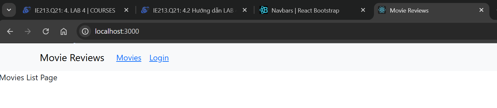
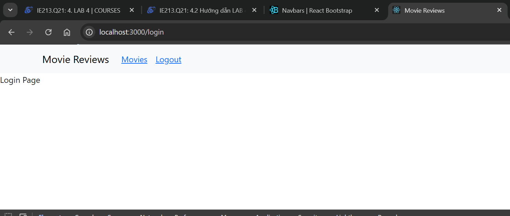

# Lab 04 – Thiết lập frontend với reactjs

Họ và tên: Nguyễn Trọng Nhân

MSSV: 22521004

Môn học: IE213.Q21

---

## Bài 1: Thiết lập nơi làm việc cho frontend

### 1.1 Tạo template frontend trong thư mục movie-reviews

### 1.2 Cài đặt một số thư viện cần thiết cho frontend

## Bài 2: Xây dựng Navigation Header bar

### 2.1 Tạo 4 component

### 2.2 Đưa Navbar vào App.js

### 2.3 Chỉnh sửa Navbar để có thể điều hướng đến các component khác nhau

## Bài 3: Thiết lập các định tuyến cho các component vừa tạo

### 3.1 Cài đặt react-router-dom

### 3.2 Thiết lập định tuyến cho các component

## Kết quả hoàn chỉnh sau khi thực hiện các bước trên:

