# Lab 05 – Xây dựng frontend với reactjs

Họ và tên: Nguyễn Trọng Nhân

MSSV: 22521004

Môn học: IE213.Q21

---

## Bài 1: Kết nối tới backend

### 1.1 Cài đặt axios

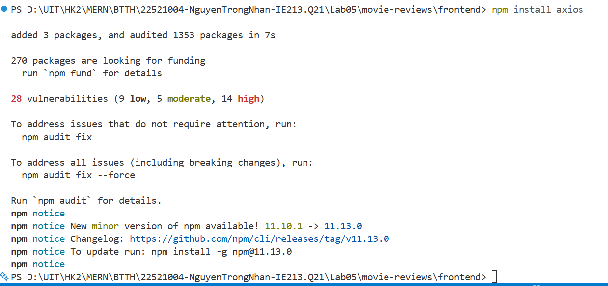

### 1.2 Tạo lớp MovieDataService để kết nối tới backend

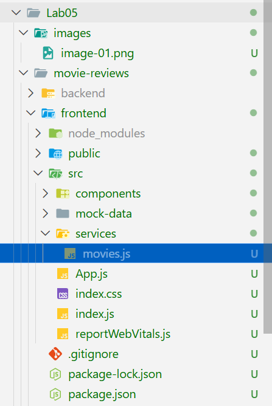

### 1.3 Tạo các lời gọi tới backend

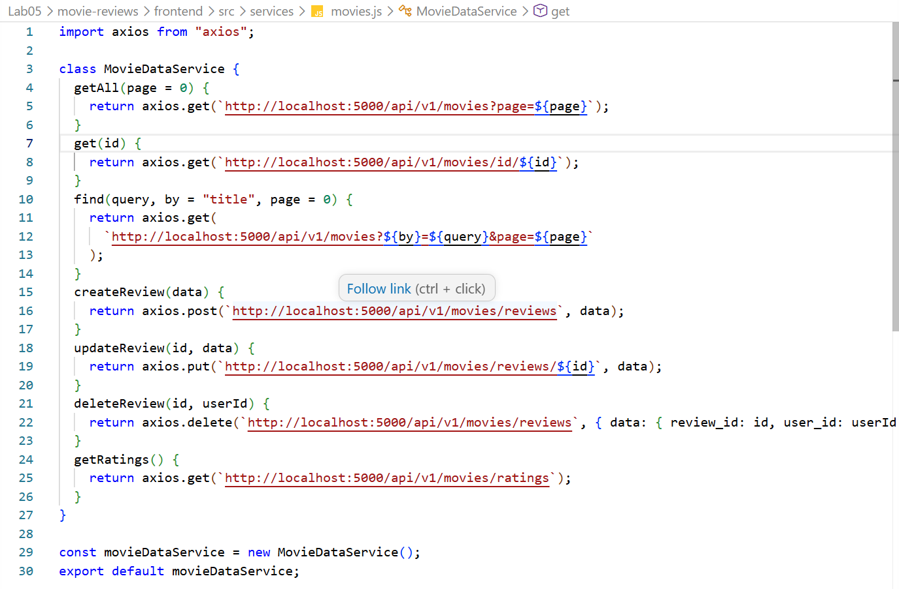

## Bài 2: Xây dựng MoviesList

### 2.1 Tạo các biến trạng thái

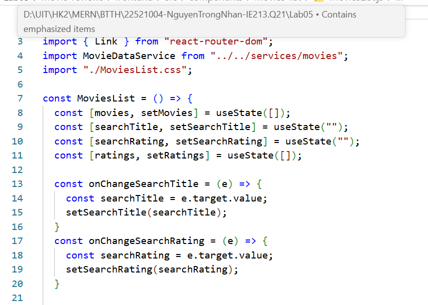

### 2.2 Tạo 2 phương thức retriveMovies() và retrieveRatings() để lấy dữ liệu từ backend và useEffect() để gọi 2 phương thức này khi component được render lần đầu tiên

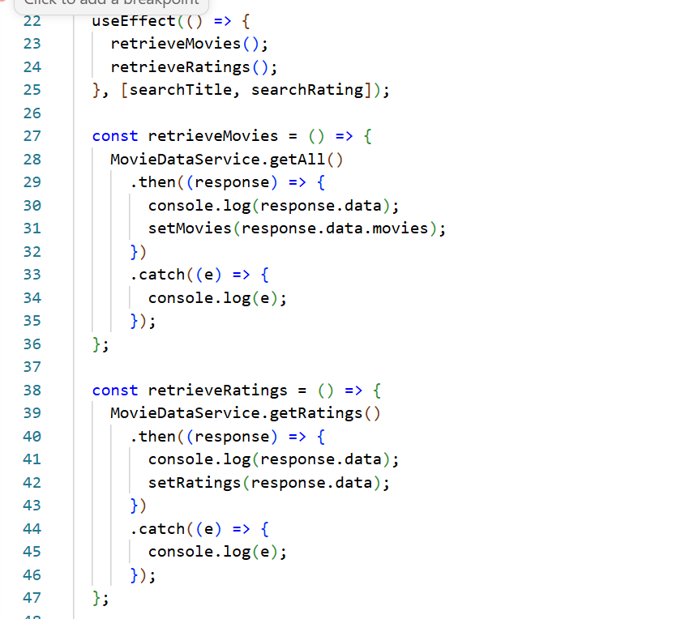

### 2.3 Tạo 2 Search Form

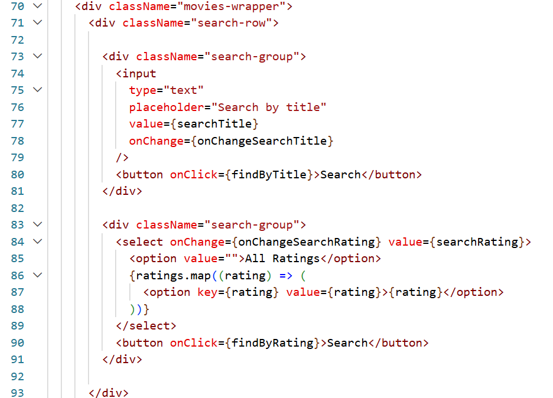
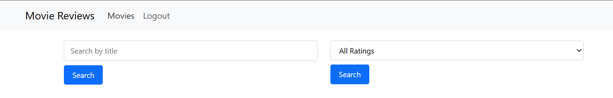

### 2.4 Hiển thị danh sách phim dưới dạng card

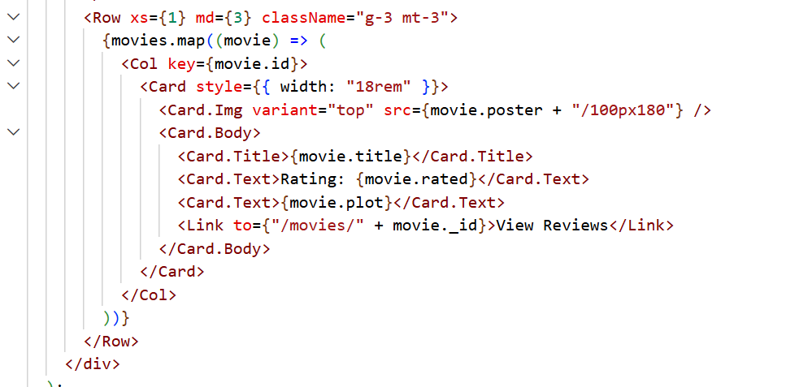
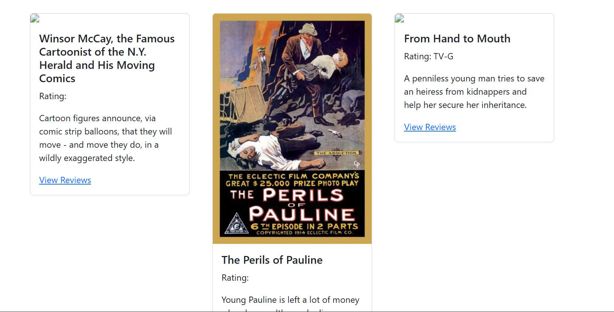

Có lẽ sau một thời gian, một số movies bị mất poster từ server.

### 2.5 Hiện thực 2 phương thức tìm kiếm findByTitle() và findByRating()

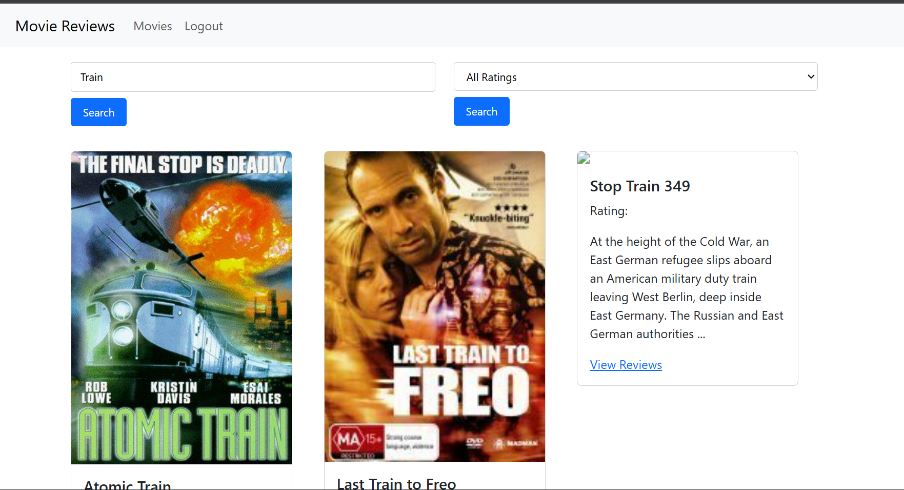

## Bài 3: Thiết lập movie details page

### 3.1 Thiết lập mã nguồn cho component Movie để hiển thị chi tiết của một movie

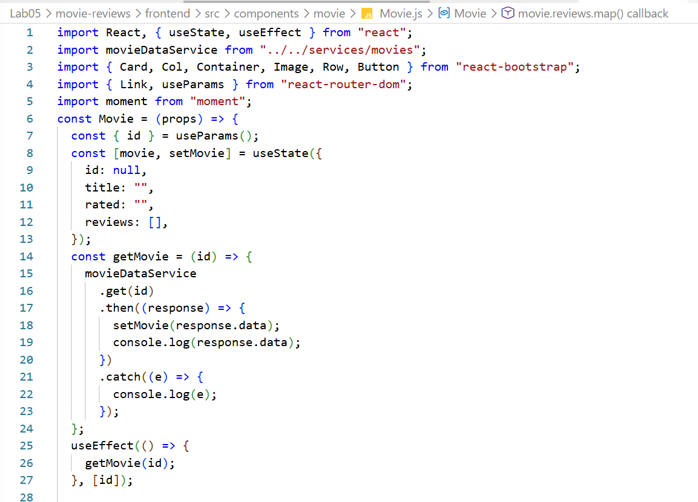

### 3.2 Trang trí phần jsx trả về để hiển thị

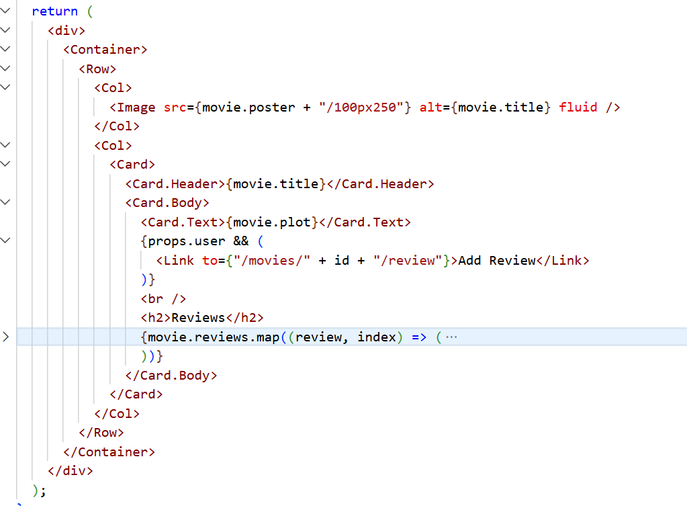
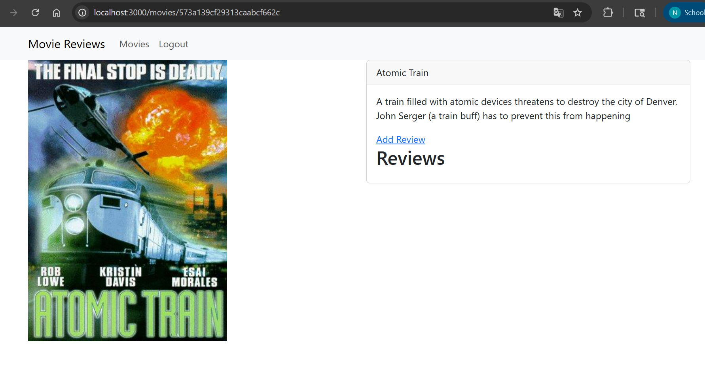

## Bài 4: Thiết lập review

### 4.1 Biết đoạn mã nguồn jsx cho phép hiển thị review của một movie

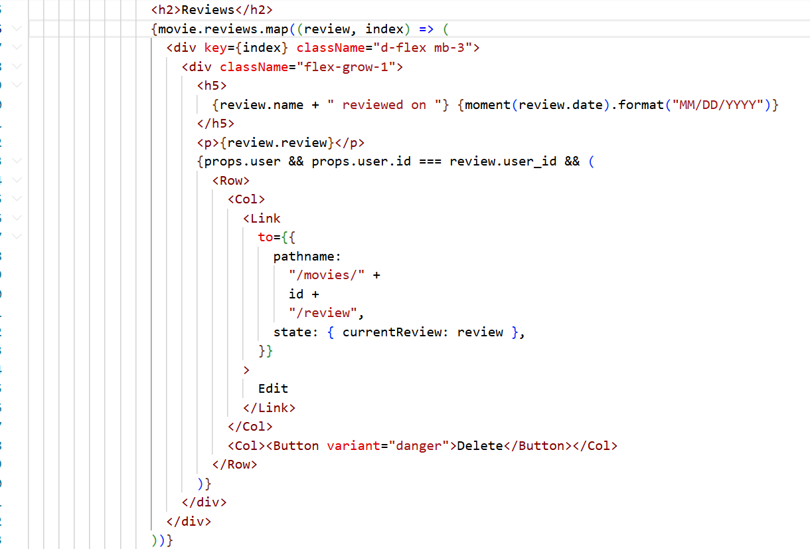

### 4.2 Tạo component AddReview để người dùng có thể thêm review cho một movie

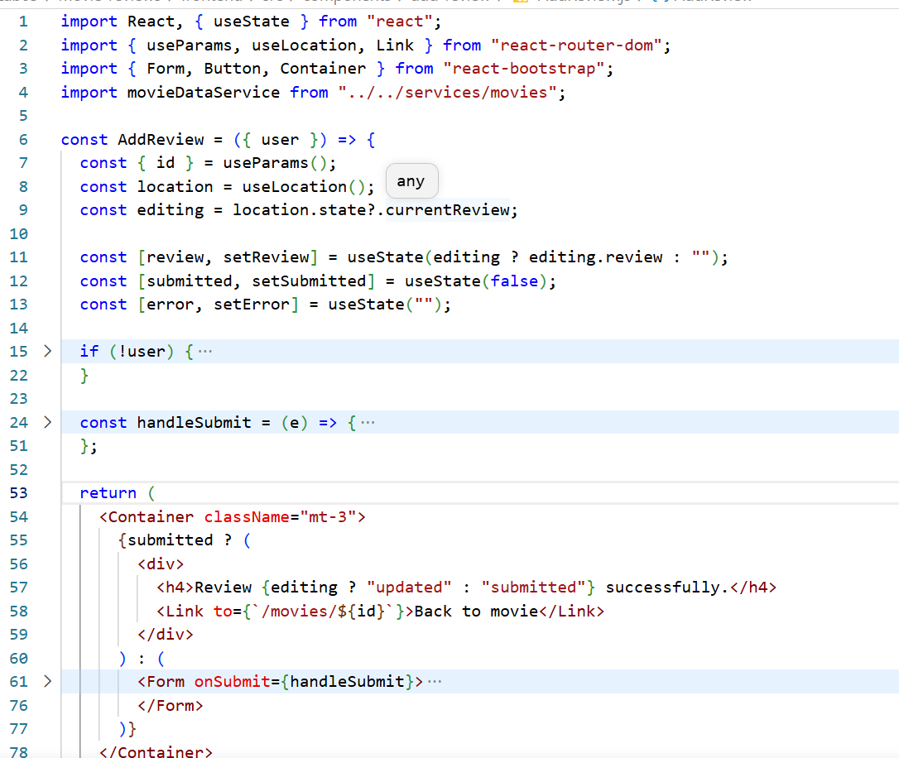
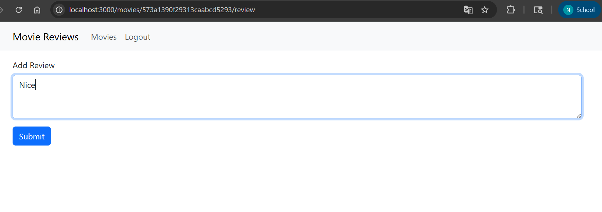

### 4.3 Giao diện cho phần thêm review

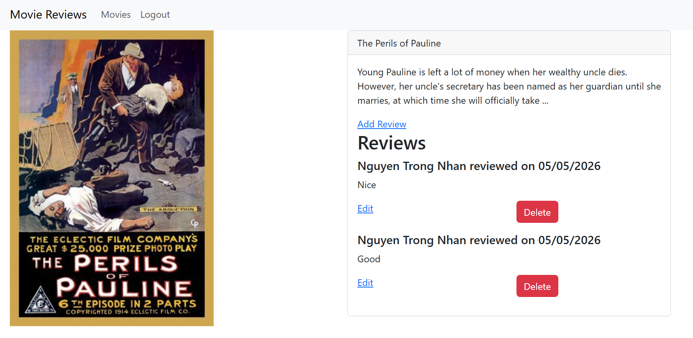
